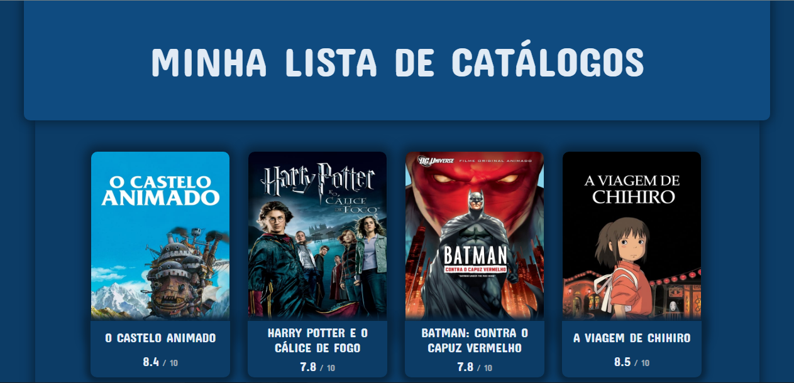
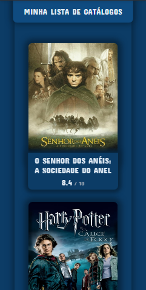

# Minha lista de catálogos

 Neste projeto eu transformei minha lista de filmes em uma pagina web. Onde é possível ver não só os nomes dos filmes, mas também imagens, resumo e outras informações interessantes.
 
 ##

  
  

 
 ##
 
 Para isso eu usei as seguintes tecnologias:
 
 

   
 
  
 

 
 ##
 
  Neste [link](https://minha-lista-de-catalogos.vercel.app/) você pode ver o projeto funcionando.
 
 ##
 
 As informações dos filmes foram retiradas de uma api da [TMDB](http://www.themoviedb.org), seguindo as normas dos termos de uso.
